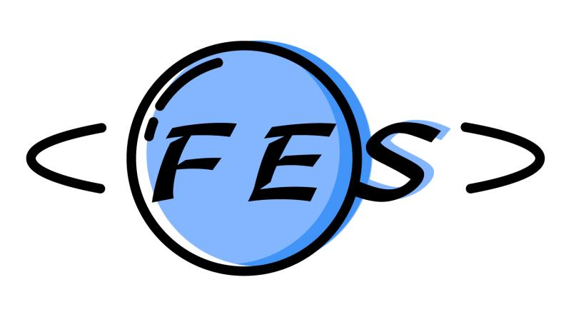

# FesHelper

- These snippets were built to supercharge my workflow in the most seamless manner possible.

## Installation

- click the extensions button (lowest square icon in the editor), and type in FesHelper, select the one by sdras

## Snippets
Temlate: Components start with wb, you can try yourself by typing wb
Script: Fes instance api start with fes$, you can try yourself by typing fes$

## Contributing
This is an open source project open to anyone. Contributions are extremely welcome :[github](https://github.com/sally2015/FesHelper.git)